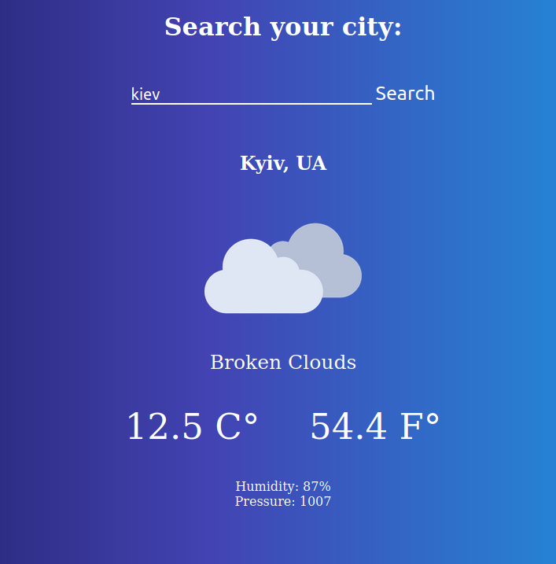

# Weather WebApp with JavaScript and Webpack.

> The weather around the world. Weather WebApp

    

In this project you will finde a weather forecast site using the [open weather API](https://openweathermap.org/). You are  able to search for a specific location and toggle displaying the data in Fahrenheit or Celsius.

## Built With

- CSS
- HTML
- JavaScript
- [webpack](https://webpack.js.org/)

## Live Demo

**Available soon..**

## Getting Started

To get a local copy up and running follow these simple example steps.

### Prerequisites

Clone the project or download the [project]('https://github.com/JuanPabloGil/Weather-App-Javascript/archive/feature.zip').

    $ git clone https://github.com/JuanPabloGil/Weather-App-Javascript.git

Install the dependencies

    $ npm install

### Usage

- Open **dist/index.html** file with your favorite browser. It's inside the project's root directory.

## Author

👤 **Juan Pablo Gil**

- [GitHub](https://github.com/JuanPabloGil )
- [@LinkedIn](https://www.linkedin.com/in/juan-pablo-gil-1321a515a/)
- jpablomgil@gmail.com

## 🤝 Contributing

Contributions, issues and feature requests are welcome!

Feel free to check the [issues page](https://github.com/fivan18/todo-list/issues).

## Show your support

Give a ⭐️ if you like this project!

## Acknowledgments

- Thanks to [Alfredo Hernandez](https://www.flaticon.com/authors/alfredo-hernandez) for the [Icons of weather](https://www.flaticon.com/packs/weather-64).

## 📝 License

This project is [MIT](LICENSE) licensed.
